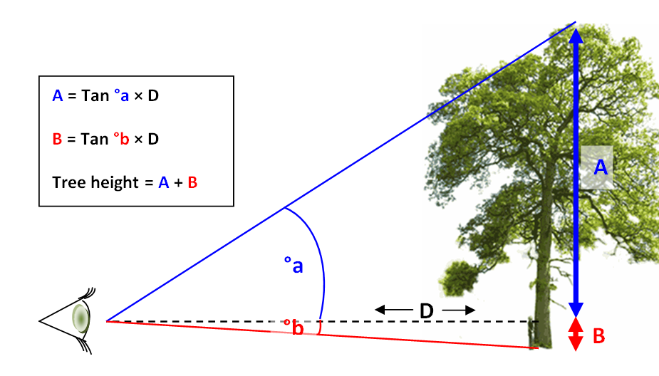

## Tree Height

Самостоятельная работа по теме 1.1

**Расчет высоты дерева(объекта) одним из методов тригонометрии**

Полезна при правке карт, например [openstreetmap](https://openstreetmap.org).

Условия: 
1. Смартфон с откалиброванным на вертикаль акселерометром
2. Строго горизонтальный взгляд попадает на само дерево (не ниже комля и не выше верхушки) 

Подготовка:
1. Измерить длину своего обычного шага в сантиметрах
2. Запустить приложение, измеряющее углы. Например "Уровень" в ***Smart ToolBox***, выбрать "Уровень лазера"

Update:
- 26/11/2022 добавил функцию проверки корректности ввода углов
- 28/11/2022 добавил функцию проверки корректности ввода шагов

Тригонометрическое решение по этой картинке:

  

  

